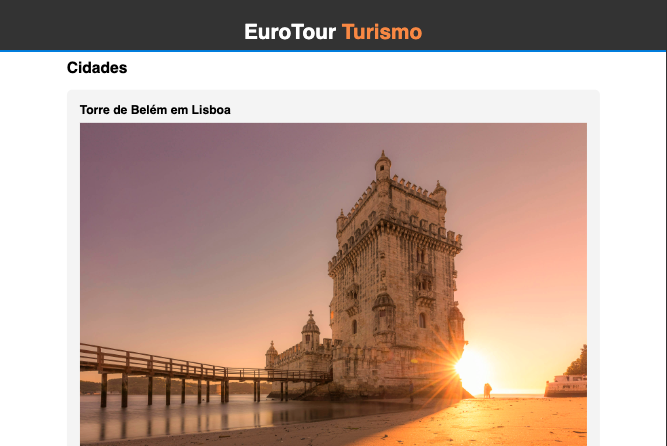
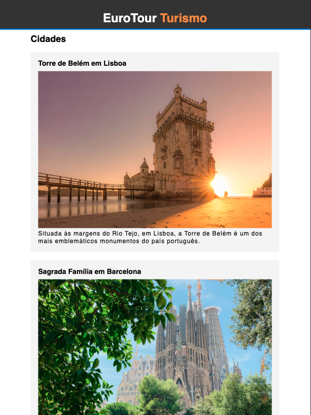
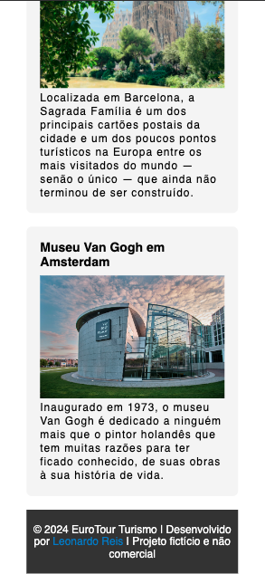

## ☕ Objetivo
Crie o corpo de uma página sobre lugares turísticos na Europa. Nela, você deve focar apenas no conteúdo da página, adicionando textos, cards, imagens, entre outros. 

## 🎨 Layout

| Desktop                 | Tablet                | Mobile                |
| ----------------------------------------- | --------------------------------------- | --------------------------------------- |
|  |  |  |
| 
