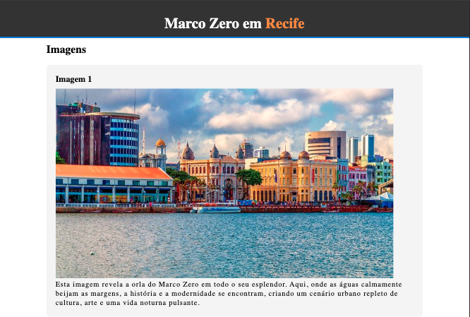
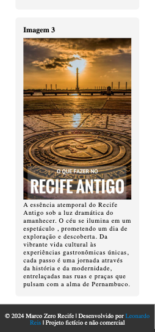

## ☕ Objetivo
A cidade do Recife é uma das mais famosas do Nordeste, ela possui diversos pontos turísticos e um deles é o Marco Zero. Sabendo disso, crie uma página HTML, falando sobre esse ponto turístico de acordo com os seguintes pré-requisitos: 

 1. A página precisa ter cabeçalho, conteúdo e rodapé;
 2. A página precisa ter imagens; 
 3. Use a tag de semântica textual inline. 

## 🎨 Layout

| Desktop                 | Tablet                | Mobile                |
| ----------------------------------------- | --------------------------------------- | --------------------------------------- |
|  |  |  |
| 