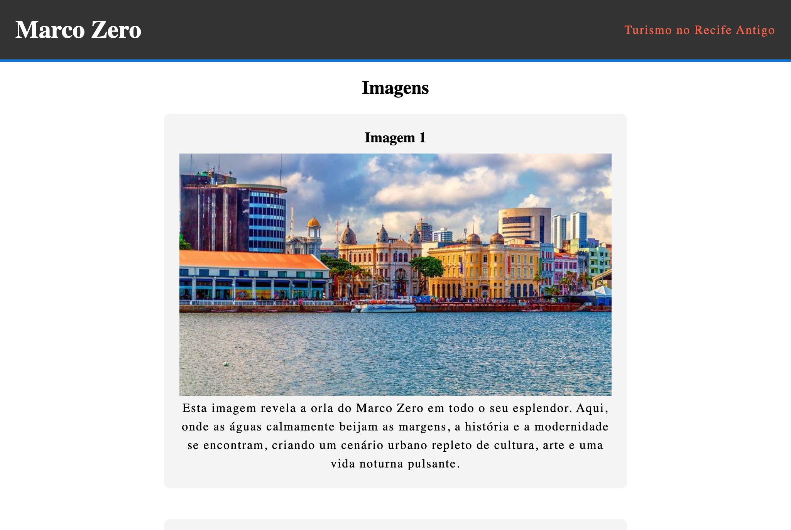
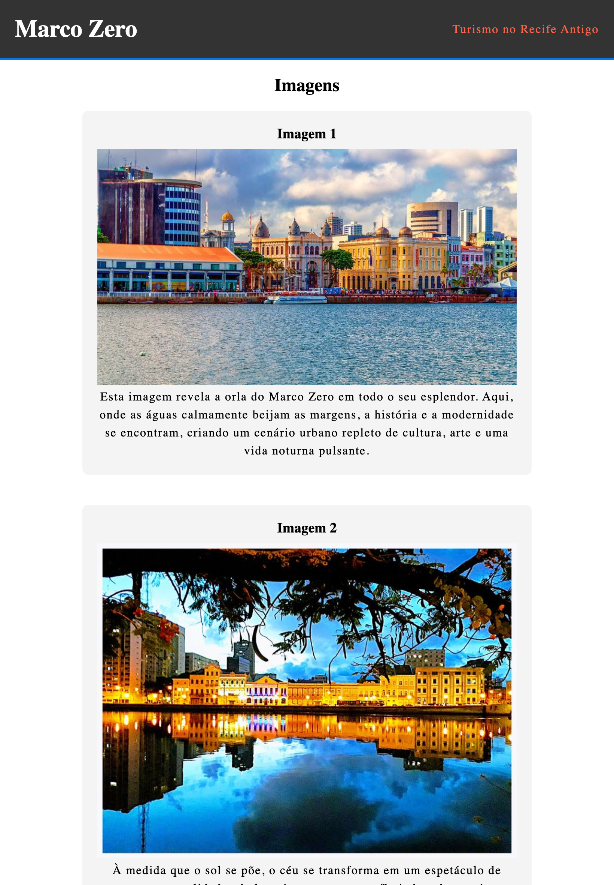
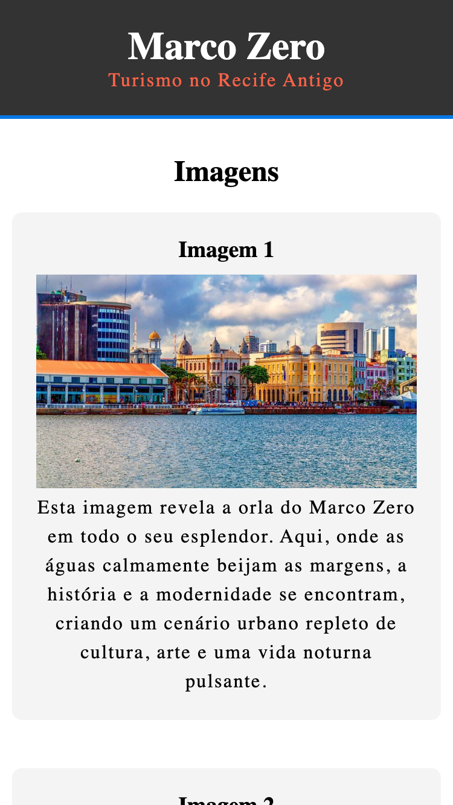

## ☕ Objetivo
Com a página sobre o Marco Zero feita, é necessário de uma outra página e de um link que leve até ela. Na nova página, fale sobre dois outros pontos turísticos do Recife Antigo e siga os pré-requisitos a seguir: 

 1. crie um link que irá direcionar para essa nova página; 
 2. adicione imagens sobre os lugares. 

## 🎨 Layout

| Desktop                 | Tablet                | Mobile                |
| ----------------------------------------- | --------------------------------------- | --------------------------------------- |
|  |  |  |